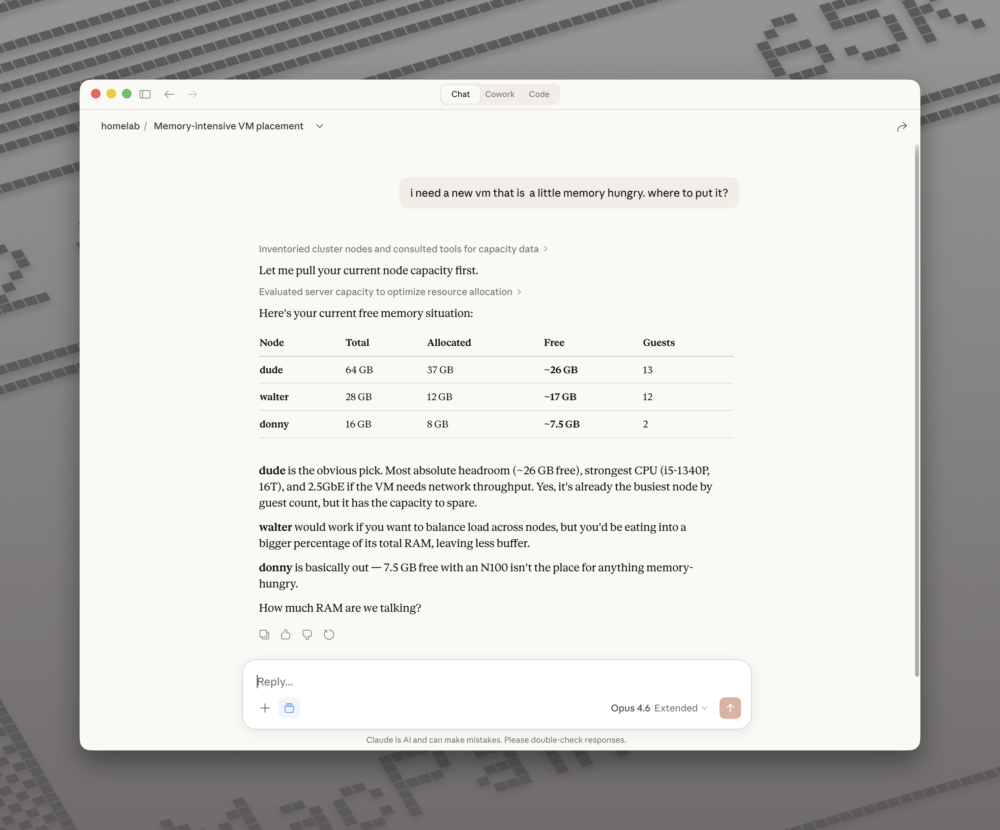
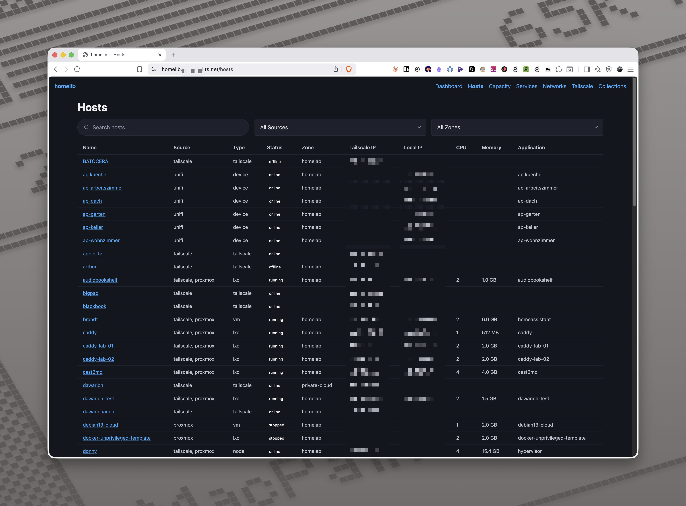
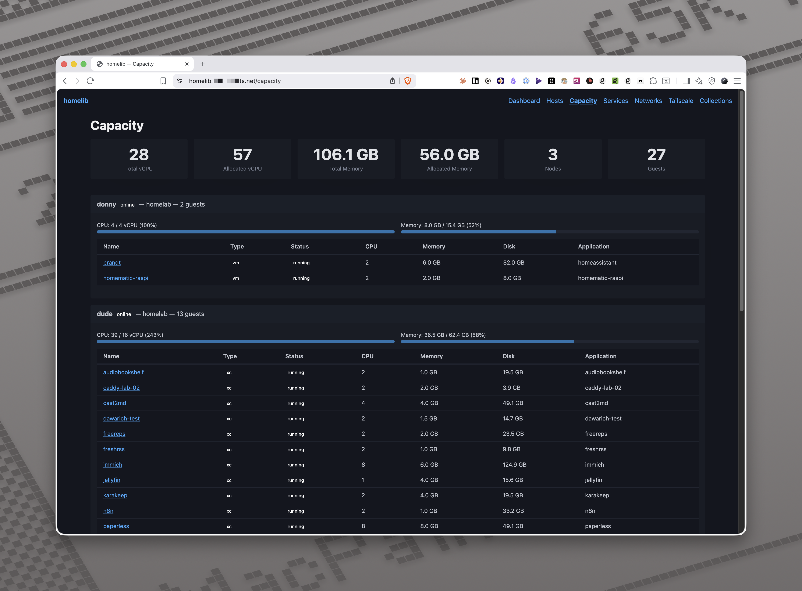
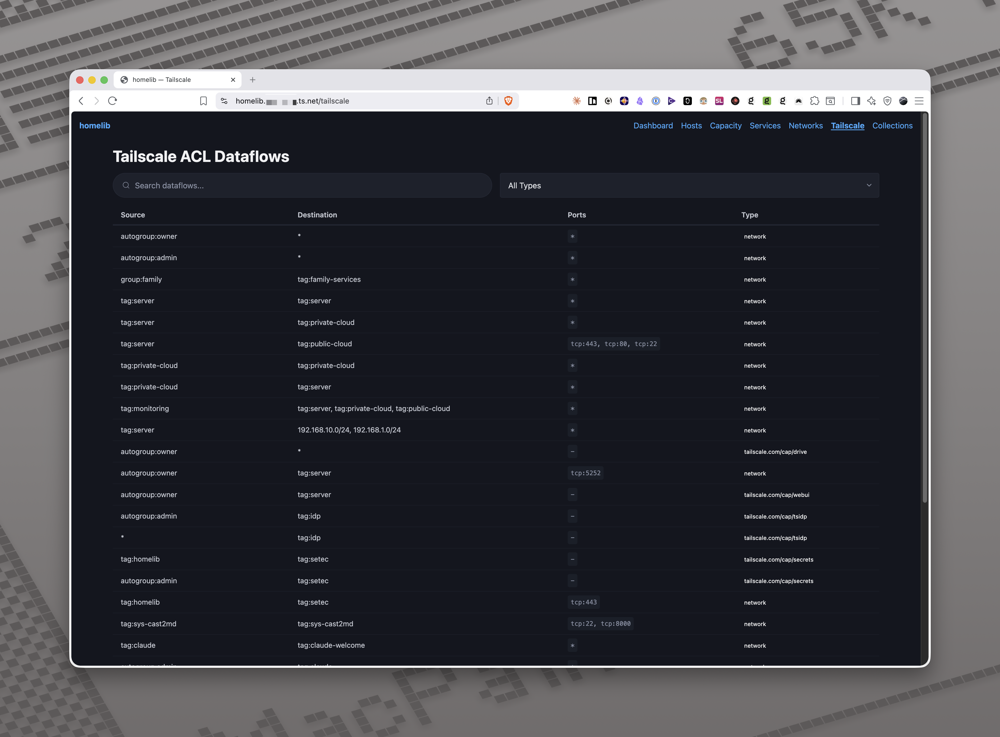

# homelib

Homelab inventory service that collects infrastructure data from multiple sources and provides a unified view through a web UI, JSON API, and MCP server.

Homelib aggregates hosts, services, networks, and capacity data from Proxmox, Tailscale, Hetzner Cloud, Komodo, and UniFi into a single SQLite database. It runs as a Tailscale node via [tsnet](https://tailscale.com/kb/1244/tsnet) — no reverse proxy or auth layer needed.

> **Note:** This is a personal side project built for my own homelab. It's published as-is and may not see regular updates or active maintenance.



## Features

- **Multi-source collection** — Proxmox (SSH), Tailscale (Local + Control Plane API), Hetzner Cloud, Komodo, UniFi
- **MCP server** — 13 tools for AI/agent integration via [Model Context Protocol](https://modelcontextprotocol.io), usable from Claude, Claude Code, or any MCP client
- **Web UI** — Dashboard, host browser, services, networks, Tailscale ACL viewer, capacity planner
- **JSON API** — Full REST API with filtering and search
- **Host merging** — Deduplicates and merges hosts discovered from multiple sources
- **Cross-referencing** — Validates zone assignments across sources, generates findings for mismatches
- **Capacity planning** — Per-node CPU/memory allocation tracking with free capacity and zone aggregates
- **Role enrichment** — Tag hosts with infrastructure roles and application categories via config
- **Plugin system** — Extend collection with custom scripts (local or SSH) that output JSON
- **Scheduled collection** — Cron-based with configurable retention
- **Graceful degradation** — Failed collectors don't block others

## Screenshots

| Hosts | Capacity | Tailscale ACLs |
|-------|----------|----------------|
|  |  |  |

## MCP Server

Homelib exposes a [Model Context Protocol](https://modelcontextprotocol.io) server at `/mcp` (Streamable HTTP). This lets AI assistants query your infrastructure directly — ask about capacity, look up hosts, search across your inventory, or trigger collections.

| Tool | Description |
|------|-------------|
| `list_hosts` | List hosts with filtering |
| `get_host` | Host details by name |
| `list_services` | Docker services, filter by host/stack |
| `list_networks` | UniFi networks/VLANs |
| `get_acl_policy` | Tailscale ACL policy |
| `get_dns_config` | Tailscale DNS configuration |
| `get_routes` | Tailscale subnet routes and exit nodes |
| `list_findings` | Infrastructure findings by source/severity |
| `get_summary` | High-level inventory stats |
| `search_inventory` | Free-text search across all data |
| `get_collection_status` | Current/latest collection status |
| `trigger_collection` | Start a new collection |
| `get_capacity` | Capacity report by node/zone |

### Using with Claude

To use homelib's MCP server with Claude.ai or other remote MCP clients, see [tsmcp](https://github.com/meltforce/tsmcp) — a gateway that exposes tsnet-based MCP servers (like homelib) over the internet with OAuth authentication.

For Claude Code or other local MCP clients on your Tailscale network, point them directly at `https://<hostname>.your-tailnet.ts.net/mcp`.

## Setup

Homelib joins your Tailscale network as its own node via tsnet. On first start, it needs a [Tailscale auth key](https://tailscale.com/kb/1085/auth-keys) to register. After that, tsnet persists its state and reconnects automatically.

### 1. Create a Tailscale auth key

Generate a reusable auth key in the [Tailscale admin console](https://login.tailscale.com/admin/settings/keys). Set it as `ts_auth_key` in your config or as the `HOMELIB_TS_AUTH_KEY` environment variable.

### 2. Create your config

```bash
cp config.example.yaml config.yaml
```

Edit `config.yaml` — enable the collectors you need and configure secrets for their APIs. See [Configuration](#configuration) for details.

### 3. Run

#### Docker Compose (recommended)

```yaml
services:
  homelib:
    image: meltforce/homelib:latest
    restart: unless-stopped
    volumes:
      - ./data:/data
    environment:
      - HOMELIB_TS_AUTH_KEY=tskey-auth-xxxxx  # only needed on first start
```

Place your `config.yaml` in `./data/config.yaml`, then:

```bash
docker compose up -d
```

Once homelib has registered with Tailscale, you can remove the `HOMELIB_TS_AUTH_KEY` variable.

#### Docker run

```bash
docker run -d \
  --name homelib \
  --restart unless-stopped \
  -v $(pwd)/data:/data \
  -e HOMELIB_TS_AUTH_KEY=tskey-auth-xxxxx \
  meltforce/homelib:latest
```

#### Binary

```bash
go build -o homelib .

# Development (localhost:8080, no Tailscale)
./homelib --local --config config.yaml

# Production (tsnet)
export HOMELIB_TS_AUTH_KEY=tskey-auth-xxxxx
./homelib --config config.yaml
```

### 4. Access

Once running, homelib is available at `https://<hostname>.your-tailnet.ts.net` (the hostname from your config, default `homelib`). No port forwarding or reverse proxy needed — access is controlled by your Tailscale ACLs.

## Configuration

Copy `config.example.yaml` and edit to match your environment. All secrets are resolved through a chain:

1. Environment variable `HOMELIB_<UPPER_KEY>` (e.g. `HOMELIB_HETZNER_API_TOKEN`)
2. [Setec](https://github.com/tailscale/setec) secret store (if `secret_backend.type: setec`)
3. [1Password CLI](https://developer.1password.com/docs/cli/) `op://` references (if value starts with `op://`)
4. Literal value

### Collectors

| Collector | Source | Data Collected |
|-----------|--------|----------------|
| **Tailscale** | tsnet Local API + Control Plane API | Devices, online status, ACLs, DNS config, subnet routes |
| **Proxmox** | SSH via Tailscale | Nodes, VMs, LXC containers, CPU/memory/disk, status |
| **Hetzner** | Cloud API | Servers, specs, pricing, firewalls |
| **Komodo** | API | Docker stacks, containers, images |
| **UniFi** | Controller API | VLANs, subnets, DHCP, network devices |

The Tailscale collector is always active — homelib runs on Tailscale via tsnet and uses the Local API as its primary data source. The other collectors can be independently enabled/disabled. All collectors run concurrently.

### Roles

Enrich discovered hosts with application and category metadata via the `roles` section. Application and category are displayed in the hosts table, capacity page, and host detail view.

```yaml
roles:
  application_categories:
    jellyfin: media-server
    immich: photos
    vaultwarden: security

  guest_overrides:
    my-vm: homeassistant    # when hostname != application name

  tailscale_devices:
    my-nas:
      role: fileserver
      application: truenas

  proxmox_nodes:
    my-node:
      infrastructure_role: hypervisor
      workload_specialization: general
```

## Plugins

Extend homelib with scripts that return JSON. Plugins run locally or via SSH and can contribute hosts, findings, and metrics.

```yaml
plugins:
  - name: my-plugin
    enabled: true
    type: ssh              # or "local"
    host: my-server
    user: root
    command: /usr/local/bin/my-script --json
    timeout: 30s
    schedule: default
```

Plugin output schema:

```json
{
  "plugin": "my-plugin",
  "version": "1.0",
  "hosts": [
    { "name": "host1", "host_type": "vm", "details": {} }
  ],
  "metrics": { "metric_name": "value" },
  "findings": [
    { "severity": "warning", "host_name": "host1", "message": "High memory usage" }
  ]
}
```

## REST API

All endpoints are under `/api/v1/`. Responses are JSON.

| Method | Endpoint | Description |
|--------|----------|-------------|
| GET | `/api/v1/hosts` | List hosts (filters: `source`, `zone`, `status`, `type`, `q`) |
| GET | `/api/v1/hosts/{name}` | Host details with associated services |
| GET | `/api/v1/services` | List services (filters: `host`, `stack`) |
| GET | `/api/v1/networks` | List networks/VLANs |
| GET | `/api/v1/findings` | List findings (filters: `source`, `severity`) |
| GET | `/api/v1/summary` | Inventory statistics |
| GET | `/api/v1/capacity` | Capacity planning report |
| GET | `/api/v1/collections` | Collection run history |
| POST | `/api/v1/collections/trigger` | Trigger a collection run |

## Architecture

```
config.yaml
    |
    v
  main.go
    |-- Store (SQLite, WAL mode)
    |-- Orchestrator
    |     |-- Collectors (Proxmox, Tailscale, Hetzner, Komodo, UniFi)
    |     |-- Plugins (custom scripts)
    |     |-- Merge (deduplicate hosts across sources)
    |     |-- Crossref (validate zones, enrich roles)
    |     '-- Persist results
    |-- Scheduler (cron)
    |-- HTTP Server
    |     |-- Web UI (embedded templates)
    |     '-- JSON API
    '-- MCP Server (/mcp)
```

## Project Structure

```
main.go                    Entry point, tsnet, HTTP server, scheduler
internal/
  config/                  YAML config, secret resolution
  model/                   Data types (Host, Service, Network, Finding, etc.)
  collector/               Collector interface + implementations
  crossref/                Zone validation, role enrichment
  store/                   SQLite persistence (WAL mode)
  capacity/                Capacity planning calculations
  scheduler/               Cron scheduling
  server/                  HTTP handlers (Web UI + JSON API)
  mcp/                     MCP server (Streamable HTTP)
  web/                     Embedded templates + static assets
```

## License

[MIT](LICENSE)
